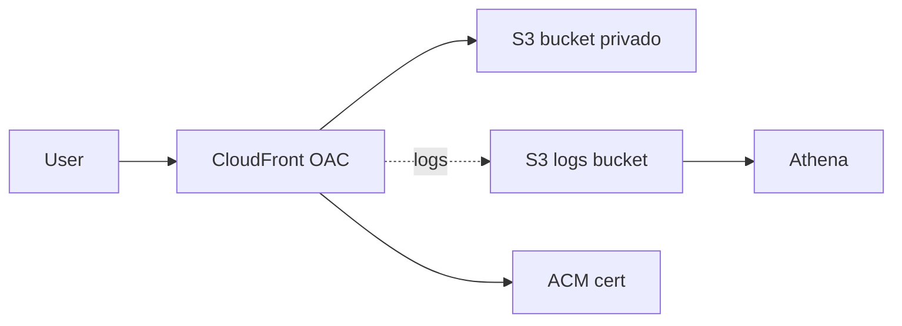
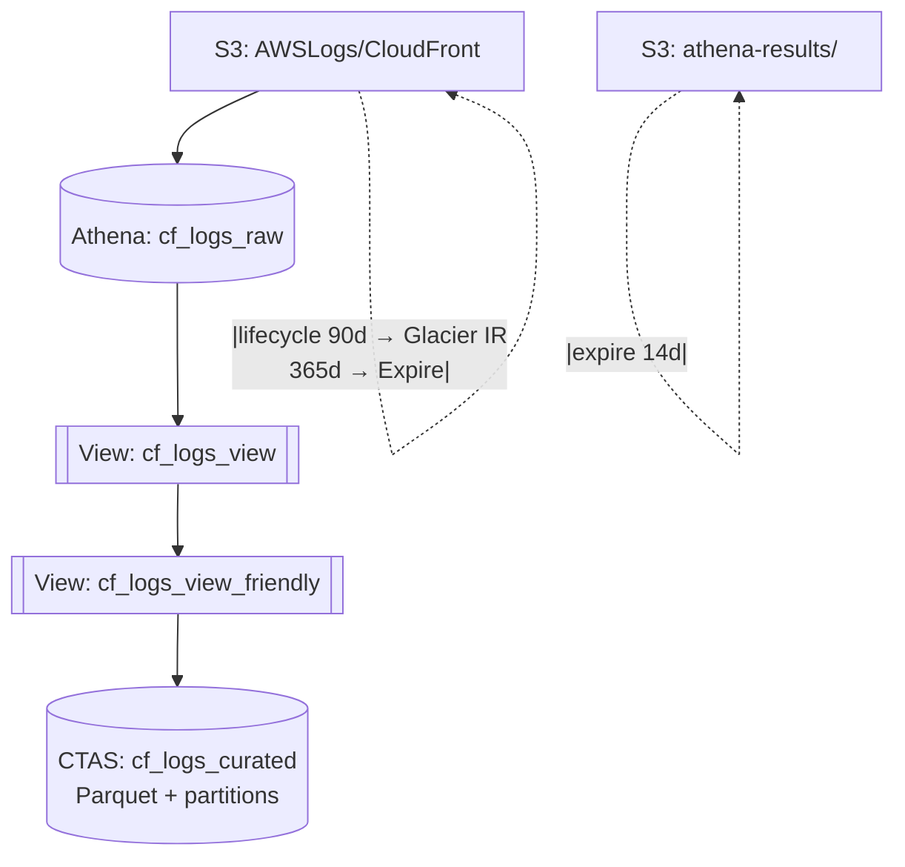

# CloudFront Logs Analytics com S3 + Athena

Pipeline para analisar logs do **Amazon CloudFront** usando **Amazon S3 + Amazon Athena**.  
Os logs brutos são convertidos em uma **tabela “curated” em Parquet particionado (ano/mês/dia/hora)** para reduzir custo e tempo de consulta.

---

## Arquitetura (Mermaid)

### 1) Alto nível


### 2) Pipeline (tabelas e views no Athena)


---

## Estrutura do repositório
```text
cloudfront-logs-analytics/
├─ README.md
├─ sql/
│  ├─ 00_ddl_cf_logs_raw.sql
│  ├─ 01_view_cf_logs_view.sql
│  ├─ 02_view_cf_logs_view_friendly.sql
│  ├─ 03_ctas_cf_logs_curated_parquet.sql
│  ├─ 10_top_ips.sql
│  ├─ 11_top_uris.sql
│  ├─ 12_errors_4xx_5xx_hour.sql
│  ├─ 13_traffic_by_hour.sql
│  └─ 14_top_user_agents.sql
├─ scripts/
│  └─ create-workgroup-cli.sh        (opcional)
└─ docs/                              (opcional se usar imagens)
   ├─ architecture.png
   ├─ lifecycle-cf-logs.png
   ├─ lifecycle-athena-results.png
   └─ athena-saved-queries.png
```

---

## Como reproduzir

1. **CloudFront**  
   Ative **Standard Logging** apontando para um **bucket privado** no S3.

2. **Athena** (workgroup com saída centralizada em `s3://…/athena-results/`):  
   - Crie a **tabela raw**: [`sql/00_ddl_cf_logs_raw.sql`](sql/00_ddl_cf_logs_raw.sql)  
   - Crie as **views**:  
     [`sql/01_view_cf_logs_view.sql`](sql/01_view_cf_logs_view.sql)  
     [`sql/02_view_cf_logs_view_friendly.sql`](sql/02_view_cf_logs_view_friendly.sql)  
   - Gere a **tabela curated (Parquet/particionado)** via CTAS:  
     [`sql/03_ctas_cf_logs_curated_parquet.sql`](sql/03_ctas_cf_logs_curated_parquet.sql)

3. **Consultas operacionais (salve como Saved Queries)**  
   [`sql/10_top_ips.sql`](sql/10_top_ips.sql) ·
   [`sql/11_top_uris.sql`](sql/11_top_uris.sql) ·
   [`sql/12_errors_4xx_5xx_hour.sql`](sql/12_errors_4xx_5xx_hour.sql) ·
   [`sql/13_traffic_by_hour.sql`](sql/13_traffic_by_hour.sql) ·
   [`sql/14_top_user_agents.sql`](sql/14_top_user_agents.sql)

4. **Lifecycle recomendado**  
   - `AWSLogs/CloudFront`: **Glacier IR aos 90 dias** e **Expire em 365d**  
   - `athena-results/`: **Expire em 14d**

---

## Troubleshooting

- **COLUMN_NOT_FOUND / colunas antigas nas views**  
  Limpe resultados antigos em `s3://…/athena-results/Unsaved/…` e rode as DDL/VIEWs novamente  
  (ou desative **Reuse query results** antes do teste).

- **HIVE_COLUMN_ORDER_MISMATCH (CTAS particionada)**  
  Em CTAS particionada, as colunas de partição (**year, month, day, hour**) precisam ser as **últimas** no `SELECT`.  
  Use o arquivo `03_ctas_cf_logs_curated_parquet.sql` deste repo (já está correto).

- **Workgroup com “Centralized output” + CTAS com `external_location`**  
  Se o workgroup **enforce centralized output** estiver habilitado, **não** use `WITH (external_location=…)` no CTAS.  
  Deixe o Athena gravar no destino padrão do workgroup.

---

## Próximos passos

- Habilitar **Partition Projection** na `cf_logs_raw` (evita `MSCK REPAIR TABLE`).  
- Construir um painel no **Amazon QuickSight** (erros/dia, top URIs, picos).  
- (Opcional) Automatizar criação de workgroup: `scripts/create-workgroup-cli.sh`.
